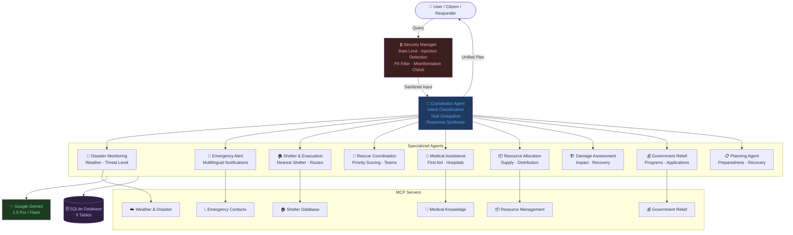
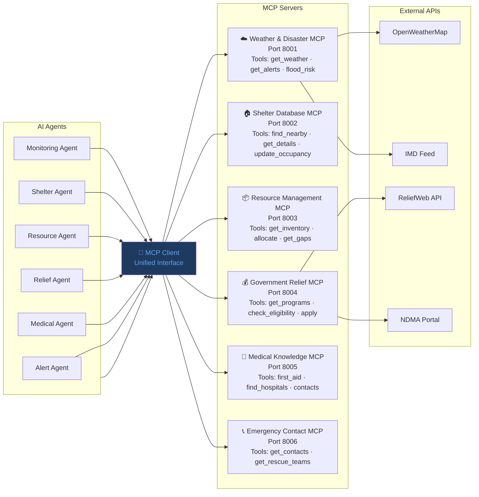
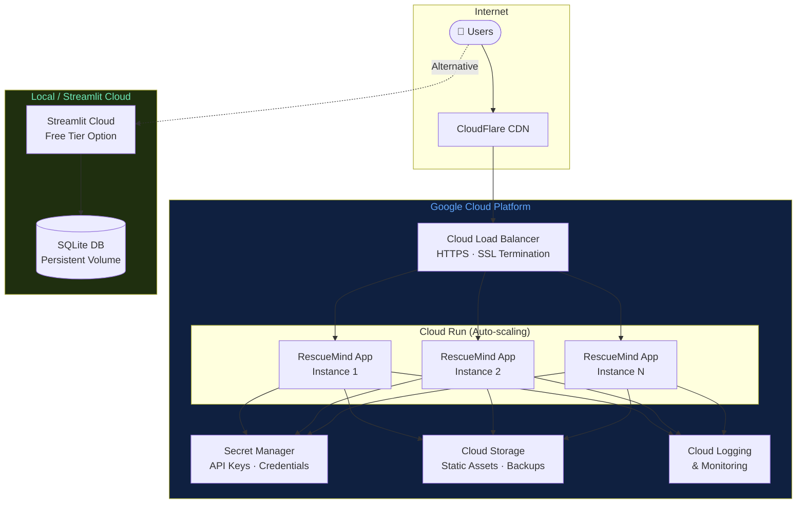
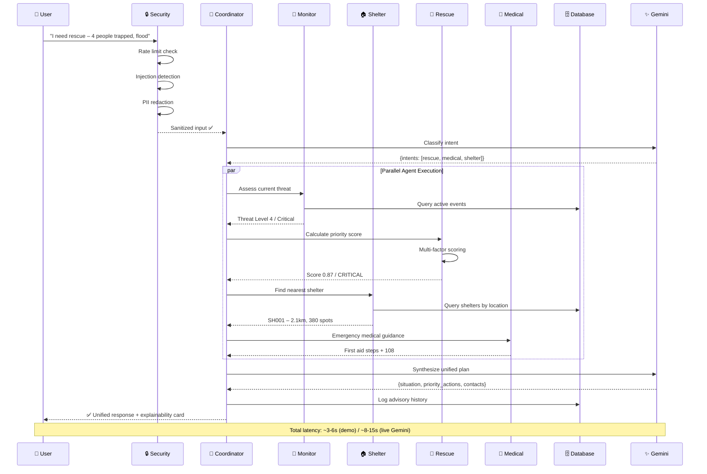
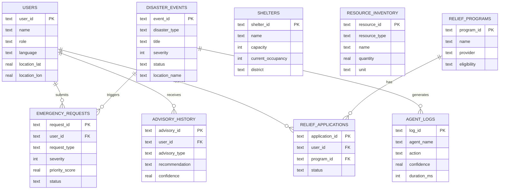

# RescueMind AI – Architecture Diagrams

## 1. Multi-Agent Interaction Flow

---

## 2. MCP Architecture

---

## 3. Deployment Architecture

---

## 4. Emergency Response Workflow

---

## 5. Database Entity Relationship

